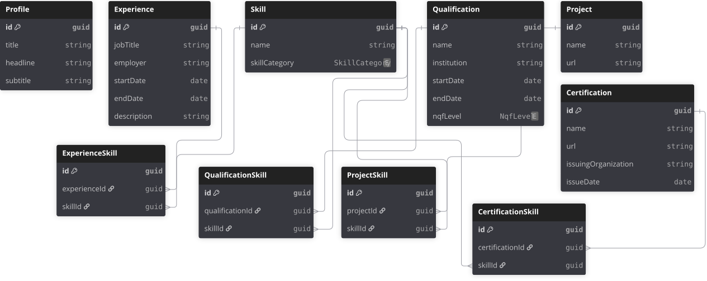

# ejmabunda-web-api

A .NET 10 Web API backing a personal portfolio site — profile, experience, qualifications, skills, projects, and certifications.

Live at `https://ejmabunda-web-api.azurewebsites.net`.

## Tech stack

- ASP.NET Core 10 (Web API, controllers)
- Entity Framework Core (SQL Server)
- JWT bearer authentication
- NSwag / OpenAPI (Swagger UI in development)
- GitHub Actions → Azure App Service (OIDC, no stored secrets)

## Architecture

Each feature follows a **Controller → Service → Repository** layering:

- **Controllers** handle HTTP concerns (routing, status codes, model binding).
- **Services** hold business rules that don't belong to data access.
- **Repositories** are the only layer that talks to `PortfolioContext` (EF Core).

Both service and repository are exposed behind interfaces (`IProfileService`, `IProfileRepository`) and registered for DI in `Program.cs`, so they can be swapped or mocked independently of the controller.

Endpoints are `[Authorize]` by default; individual actions opt back out with `[AllowAnonymous]` where public read/write access is intended (see [API](#api) below).

## Getting started

**Prerequisites:** .NET 10 SDK, a reachable SQL Server instance (LocalDB/Express work fine for local dev).

```bash
dotnet restore

# Point ConnectionStrings:DefaultConnection (appsettings.json or user-secrets) at your SQL Server instance,
# then apply migrations:
dotnet ef database update

dotnet run
```

In development, the OpenAPI document is served at `/openapi/v1.json` with Swagger UI available for exploring the API.

## Configuration

| Setting | Where | Purpose |
| --- | --- | --- |
| `ConnectionStrings:DefaultConnection` | `appsettings.json` / user-secrets / environment | SQL Server connection string |
| JWT bearer options | `Program.cs` (`AddJwtBearer`) | Token validation for `[Authorize]` endpoints |
| CORS origin | `Program.cs` (`FrontendCorsPolicy`) | Allows `https://ejmabunda.dev` to call the API from a browser |

## API

### Profile (`/api/Profile`)

The profile is a **singleton** — there is always zero or one row, so these actions operate on "the" profile rather than one identified by an id in the route.

| Method | Route | Auth | Description |
| --- | --- | --- | --- |
| `GET` | `/api/Profile` | Anonymous | Returns the profile, or `404` if none exists |
| `POST` | `/api/Profile` | Anonymous | Creates the profile; `409` if one already exists |
| `PUT` | `/api/Profile` | Required | Updates the profile; omitted fields are left unchanged |
| `DELETE` | `/api/Profile` | Required | Deletes the profile |

Full request/response shapes are documented via XML doc comments on the controller and DTOs, and surfaced in Swagger UI (`/openapi/v1.json` in development).

## Data model

Source of truth: [`docs/erd/portfolio-erd.dbml`](docs/erd/portfolio-erd.dbml) (edit here, then paste into [dbdiagram.io](https://dbdiagram.io) to regenerate the SVG below).

Only `Profile` currently has a controller/service/repository; the other entities exist in the schema ahead of their own endpoints.



## Project structure

```text
Controllers/   API endpoints
Dtos/          Request/response shapes for controllers
Services/      Business logic, one interface + implementation per feature
Repositories/  EF Core data access, one interface + implementation per feature
Models/        Domain entities and the PortfolioContext DbContext
Migrations/    EF Core migrations
docs/erd/      Entity relationship diagram (dbml source + generated svg)
```

## Deployment

Pushes to `main` trigger [`.github/workflows/deploy.yaml`](.github/workflows/deploy.yaml), which builds, publishes, and deploys to Azure App Service. Authentication uses OIDC via a federated Entra ID app registration — no stored Azure credentials.

Schema changes require a migration to be applied to the Azure database before/around deploy:

```bash
dotnet ef migrations add <Name>
dotnet ef database update --connection "<azure connection string>"
```
