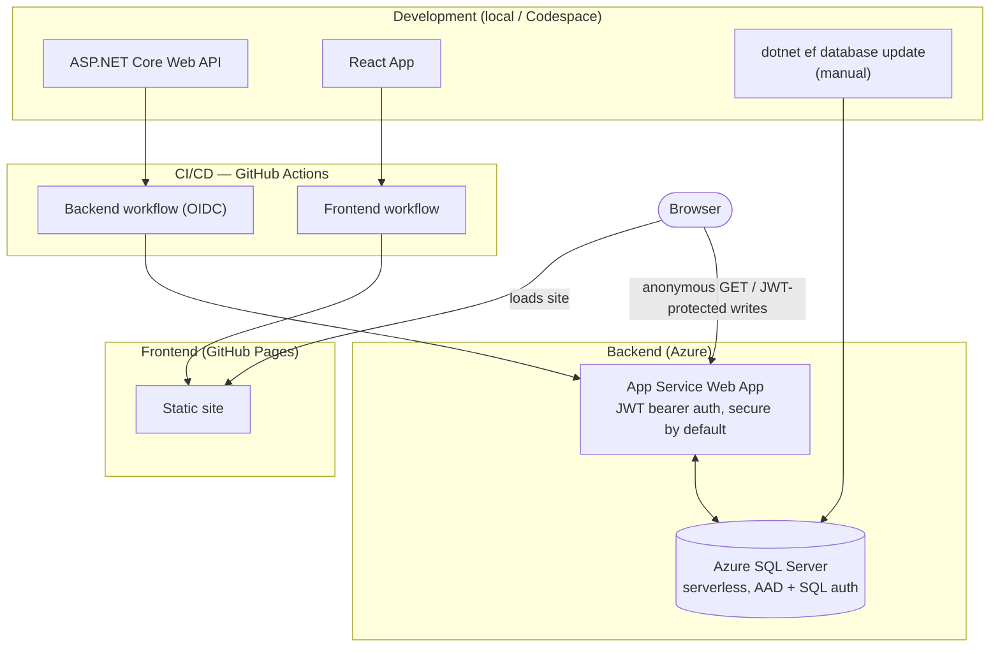

# ejmabunda-web-api

A .NET 10 Web API backing a personal portfolio site — profile, experience, qualifications, skills, projects, and certifications.

Live at `https://ejmabunda-web-api-dfg5bzfbh2c8e3h5.southafricanorth-01.azurewebsites.net`.

## Tech stack

- ASP.NET Core 10 (Web API, controllers)
- Entity Framework Core (SQL Server)
- JWT bearer authentication (RSA-signed, issued via `/api/Login`)
- NSwag / OpenAPI (Swagger UI in development)
- GitHub Actions → Azure App Service (OIDC, no stored secrets)

## Architecture

Most features follow a **Controller → Service → Repository** layering:

- **Controllers** handle HTTP concerns (routing, status codes, model binding).
- **Services** hold business rules that don't belong to data access.
- **Repositories** are the only layer that talks to `PortfolioContext` (EF Core, in `Data/`).

Service and repository are exposed behind interfaces (`IProfileService`, `IProfileRepository`, `IUserRepository`) and registered for DI in `Program.cs`, so they can be swapped or mocked independently of the controller. `LoginController` is the exception — it's thin enough to talk to `IUserRepository` directly rather than through a service.

Endpoints are `[Authorize]` by default; individual actions opt back out with `[AllowAnonymous]` where public read access is intended (see [API](#api) below).



The frontend calls the API directly from the browser (CORS-restricted to `ApiSettings:FrontendUrl`, see [Configuration](#configuration)) — App Service doesn't push anything to GitHub Pages. Migrations are applied manually against Azure SQL; there's no migration step in [`deploy.yaml`](.github/workflows/deploy.yaml).

## Getting started

**Prerequisites:** .NET 10 SDK, a reachable SQL Server instance (LocalDB/Express work fine for local dev).

```bash
dotnet restore

# Point ConnectionStrings:DefaultConnection (appsettings.json or user-secrets) at your SQL Server instance,
# then apply migrations:
dotnet ef database update

dotnet run
```

In development, the OpenAPI document is served at `/openapi/v1.json` with Swagger UI available for exploring the API.

## Configuration

`ApiSettings:ApiUrl` and `ApiSettings:FrontendUrl` are set per environment: `appsettings.json` holds the production values (live API host, `https://ejmabunda.dev`), and `appsettings.Development.json` overrides both for local dev (`http://localhost:5014`, `http://localhost:3000`).

| Setting | Where | Purpose |
| --- | --- | --- |
| `ConnectionStrings:DefaultConnection` | `appsettings.json` / user-secrets / environment | SQL Server connection string |
| `ApiSettings:ApiUrl` | `appsettings*.json` | JWT issuer/audience, validated in `Program.cs` (`AddJwtBearer`) and set when `LoginController` issues a token |
| `ApiSettings:FrontendUrl` | `appsettings*.json` | The single origin allowed to call the API from a browser (`Program.cs`, `FrontendCorsPolicy`) |

The JWT signing key (RSA 2048) is generated in memory at startup rather than read from config, so tokens don't survive an app restart — logging in again is required after each deploy.

## API

### Login (`/api/Login`)

| Method | Route | Auth | Description |
| --- | --- | --- | --- |
| `POST` | `/api/Login` | Anonymous | Verifies the password against the singleton admin `User`; returns a JWT bearer token (10 min lifetime) on success |

### Profile (`/api/Profile`)

The profile is a **singleton** — there is always zero or one row, so these actions operate on "the" profile rather than one identified by an id in the route.

| Method | Route | Auth | Description |
| --- | --- | --- | --- |
| `GET` | `/api/Profile` | Anonymous | Returns the profile, or `404` if none exists |
| `POST` | `/api/Profile` | Required | Creates the profile; `409` if one already exists |
| `PUT` | `/api/Profile` | Required | Updates the profile; omitted fields are left unchanged |
| `DELETE` | `/api/Profile` | Required | Deletes the profile |

Full request/response shapes are documented via XML doc comments on the controller and DTOs, and surfaced in Swagger UI (`/openapi/v1.json` in development).

## Data model

Source of truth: [`docs/erd/portfolio-erd.dbml`](docs/erd/portfolio-erd.dbml) (edit here, then paste into [dbdiagram.io](https://dbdiagram.io) to regenerate the SVG below).

`Profile` has a full CRUD controller. `User` backs `/api/Login` only (read + password update via `IUserRepository`, no dedicated controller). The remaining entities exist in the schema ahead of their own endpoints.


## Project structure

```text
Controllers/   API endpoints
Dtos/          Request/response shapes for controllers
Services/      Business logic, one interface + implementation per feature
Repositories/  EF Core data access, one interface + implementation per feature
Models/        Domain entities and DTOs used across layers (e.g. ApiSettings, Token)
Data/          The PortfolioContext DbContext (EF Core)
Migrations/    EF Core migrations
docs/erd/      Entity relationship diagram (dbml source + generated svg)
```

## Deployment

Pushes to `main` trigger [`.github/workflows/deploy.yaml`](.github/workflows/deploy.yaml), which builds, publishes, and deploys to Azure App Service. Authentication uses OIDC via a federated Entra ID app registration — no stored Azure credentials.

Schema changes require a migration to be applied to the Azure database before/around deploy:

```bash
dotnet ef migrations add <Name>
dotnet ef database update --connection "<azure connection string>"
```
